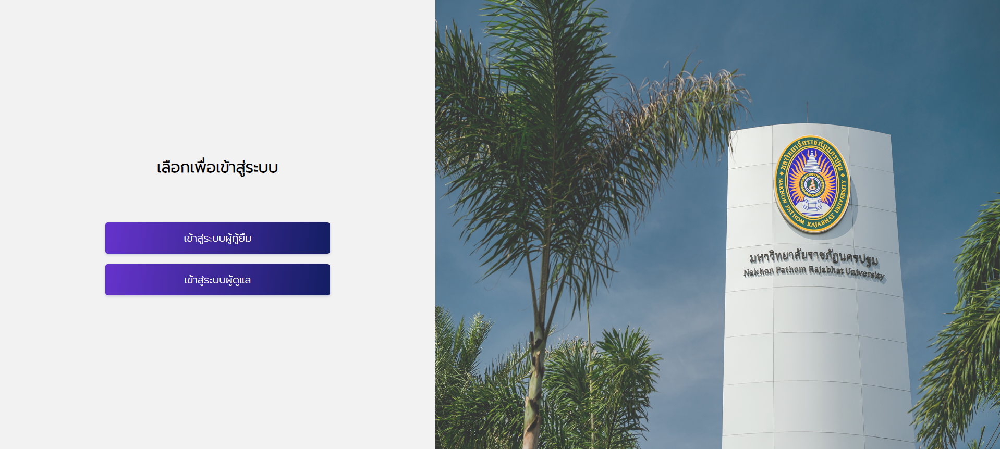

# 💻 เว็บไซต์บันทึกกิจกรรมจิตอาสาด้วย PHP

````````
📚 โครงงานนี้ส่วนหนึ่งของการศึกษารายวิชา 7204902 โครงงานด้านเทคโนโลยีสารสนเทศ 
📚 สาขาวิชาเทคโนโลยีสารสนเทศ 
📚 คณะวิทยาศาสตร์และเทคโนโลยี มหาวิทยาลัยราชภัฏนครปฐม 

````````
## 🚀 หน้าตาเว็บไซต์ 
````````
เว็บไซต์ระบบบันทึกกิจกรรมจิตอาสาของกองทุนเงินให้กู้ยืม เพื่อการศึกษา (กยศ) กรณีศึกษามหาวิทยาลัยราชภัฏนครปฐม  

````````
>> [](http://projectnpru-chairta.com/)

## 🛠 โปรแกรมที่ใช้พัฒนา 

[](https://www.php.net/)
[](https://www.mysql.com//)
[](https://www.apachefriends.org/) 


## 👥 ผู้จัดทำ 
````````
นายพิธีกร คงมะคา 
นายวงศธร กันศิริ 
นายชัยรัตน์ ดวงสอาด 
````````
## 💾 ฐานข้อมูล 
⏩ [Download SQL File](database/project7_chairatNPRU.sql)
